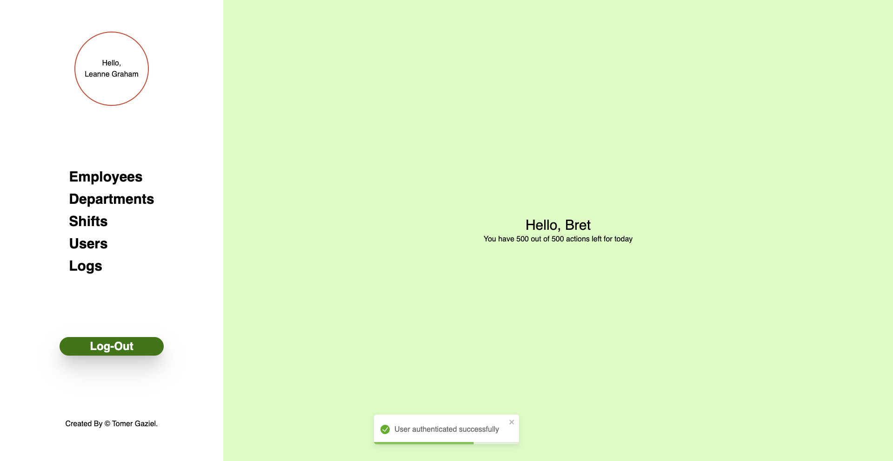

# Factory management

The challenge [PDF](./screenshots/Node.JS%20-%20Final%20Project.pdf)

## Installation and operation

To run the project you need to create an .env file in backend folder

> .env file

```
PORT= (your port)
JWT_SECRET= (your secret string)
```

on the login screen there is a button to add fake data to the database.

> **you must click on it to connect to the system, it contains employee data, departments, shifts and users who can connect to the system and perform actions.**

## Overview

This system is intended for managing employees, departments and shifts in the organization. It provides a comprehensive API interface for performing CRUD operations (create, read, update and delete) on various entities in the system.

> Every day at 00:00 the number of daily actions each user has will be reset to the number of actions defined for him

> Each user can stay connected continuously for 30 minutes. After this period, the system will automatically disconnect them. Reconnection is required to resume actions.


## Main ingredients

### 1. Employee management

- Presentation of all employees
- Adding a new employee
- Employee details update
- Deleting an employee

### 2. Management of departments

- Showing all departments
- Creating a new department
- Updating department details
- Deletion of a department (including the removal of all employees belonging to the department)

### 3. Shift management

- Showing all shifts
- Creating a new shift
- Update shift details
- Associating workers to shifts

### 4. User management

- Showing all users
- User authentication (login)
- Creating sample data (seeding)

## Security

The system uses a JWT (JSON Web Tokens) based authentication mechanism to protect the endpoints of the API. In addition, there is a tracking mechanism for user actions.

## Technologies

- **Programming language**: JavaScript (Node.js) (ReactJS)
- **Working framework**: Express.js
- **Database**: MongoDB
- **state management**: Redux & Redux toolkit

## The structure of the project

The project is organized according to the principles of layered architecture:

- **Controllers**: handle HTTP requests and respond accordingly
- **Services**: contain the business logic of the system
- **Repositories**: responsible for the interaction with the database
- **Middlewares**: handle authentication and monitoring of operations

## API Endpoints

Below is a partial list of the main endpoints:

- `GET /employees`: getting all employees
- `POST /employees`: creating a new employee
- `GET /departments`: getting all departments
- `POST /departments`: creating a new department
- `GET /shifts`: getting all shifts
- `POST /shifts`: Create a new shift
- `POST /users/login`: User login

# Manage application state with Redux Toolkit and Thunk

## General structure

The project manages several business areas:

1. Authentication (auth)
2. Departments
3. Employees
4. Employee shifts (employeeShift)
5. Shifts
6. Users

Each field is represented by:

- `*Service.js`: communication logic with the API
- `*Slice.js`: defining the state, reducers, and thunks

## Using the Redux Toolkit

- All `*Slice.js` use `createSlice` and `createAsyncThunk`
- Enables central state management for all business areas

## The role of the Thunk

In every field, the thunks allow:

1. Performing asynchronous operations (like API calls)
2. Access to the current state (for example, to obtain an authentication token)
3. Handling errors uniformly

## Access advantages

1. **Separation of responsibilities**: Each business area is managed separately
2. **Global Status Management**: Easy access to information from all components
3. **Support for asynchrony**: uniform handling of all calls to the server
4. **Maintainability**: A consistent structure makes it easier to extend the application

## Usage example

```javascript
// Actions from any field can be used easily
dispatch(auth.actions.login(credentials));
dispatch(departments.actions.getAllDepartments());
dispatch(employees.actions.addEmployee(newEmployee));
```

## List of users with whom you can connect to the system

```json
[
  {
    "username": "Bret",
    "email": "Sincere@april.biz"
  },
  {
    "username": "Antonette",
    "email": "Shanna@melissa.tv"
  },
  {
    "username": "Samantha",
    "email": "Nathan@yesenia.net"
  },
  {
    "username": "Karianne",
    "email": "Julianne.OConner@kory.org"
  },
  {
    "username": "Kamren",
    "email": "Lucio_Hettinger@annie.ca"
  },
  {
    "username": "Leopoldo_Corkery",
    "email": "Karley_Dach@jasper.info"
  },
  {
    "username": "Elwyn.Skiles",
    "email": "Telly.Hoeger@billy.biz"
  },
  {
    "username": "Maxime_Nienow",
    "email": "Sherwood@rosamond.me"
  },
  {
    "username": "Delphine",
    "email": "Chaim_McDermott@dana.io"
  },
  {
    "username": "Moriah.Stanton",
    "email": "Rey.Padberg@karina.biz"
  }
]
```
## Screenshots





